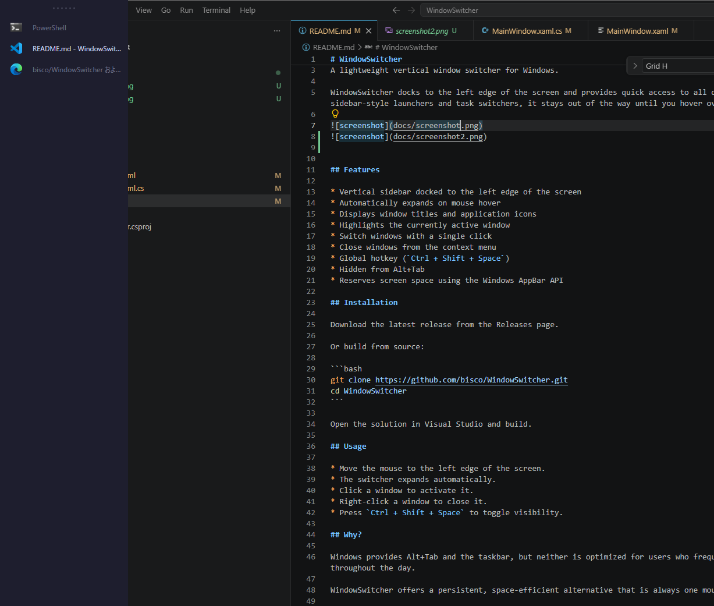
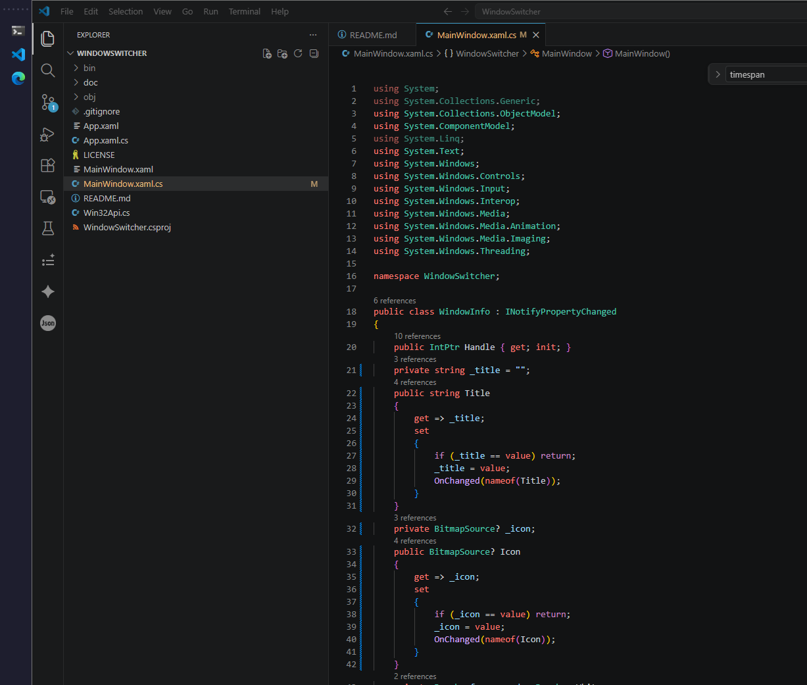

# WindowSwitcher

A lightweight vertical window switcher for Windows.

WindowSwitcher docks to the left edge of the screen and provides quick access to all open windows. It stays compact while idle and expands automatically when hovered.

<p align="center">
  <a href="docs/screenshot-expanded.png">
    
  </a>
  <a href="docs/screenshot-collapsed.png">
    
  </a>
</p>

## Features

* Docked to the left edge of the screen using the Windows AppBar API
* Automatically expands on mouse hover
* Displays window icons and titles
* Highlights the currently active window
* Updates window titles dynamically (e.g. browser tab changes)
* Switch windows with a single click
* Close windows from the context menu
* Global hotkey (`Ctrl + Shift + Space`)
* Hidden from Alt+Tab
* Tooltips for truncated window titles
* Lightweight and always available

## Download

Download the latest release from the Releases page.

## Usage

* Move the mouse to the left edge of the screen.
* The switcher expands automatically.
* Click a window to activate it.
* Right-click a window to open the context menu.
* Press `Ctrl + Shift + Space` to show or hide the switcher.

## Building

Requirements:

* Windows 10 or later
* .NET 10 SDK

Build and run:

```bash
dotnet run
```

Publish:

```bash
dotnet publish -c Release -r win-x64 --self-contained true -p:PublishSingleFile=true
```

## Motivation

WindowSwitcher was built as an alternative to Alt+Tab and the Windows taskbar for users who frequently switch between many windows throughout the day.

The goal is to provide a fast, always-visible window switcher that requires minimal mouse movement and screen space.

## Roadmap

Future ideas:

* Start automatically with Windows
* Customizable hotkeys
* User settings
* Multi-monitor support improvements
* Search/filter windows

## License

MIT License
